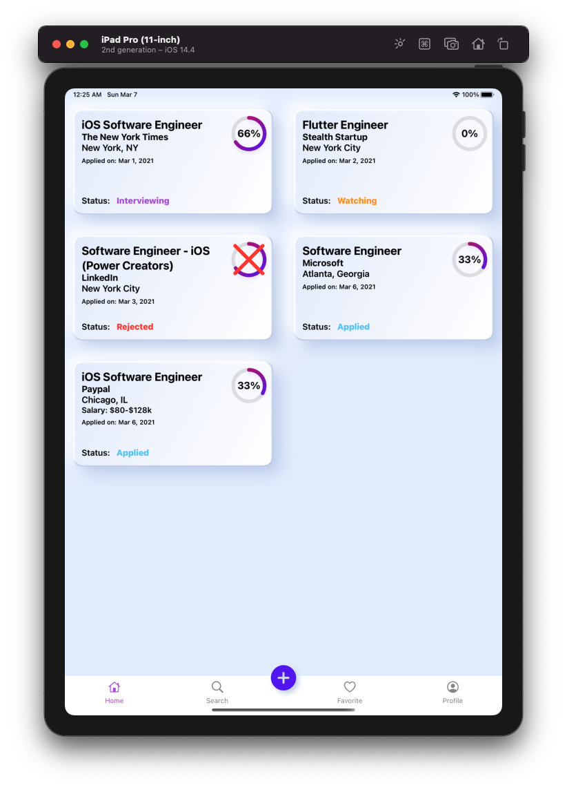
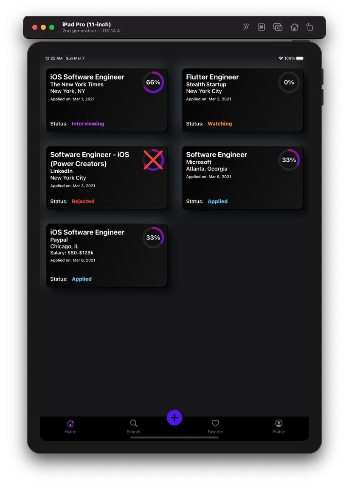
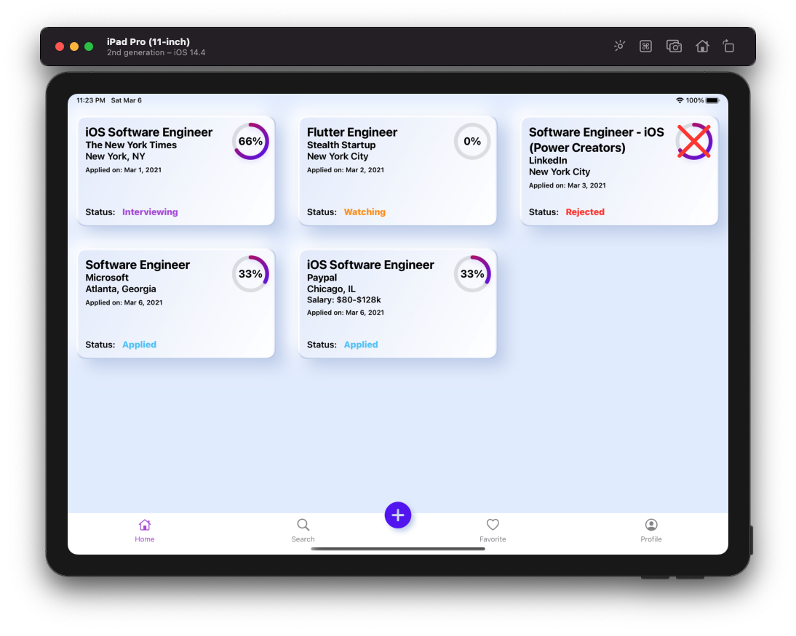
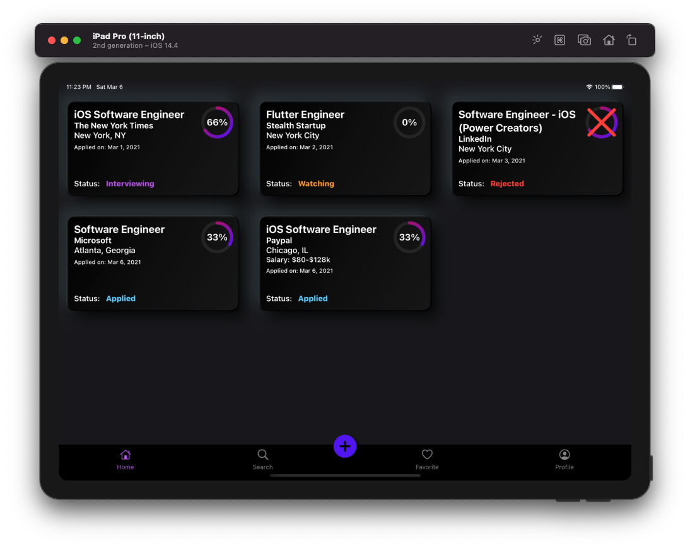

# JobAppTracker
Job Application Tracker

## Technologies Used
* SwiftUI (https://developer.apple.com/documentation/swiftui)
* Combine (https://firebase.google.com/docs)
* Firebase Authentication (https://firebase.google.com/docs/auth)
* Firebase Firestore (https://firebase.google.com/docs/firestore

| iPhone Light Mode | iPhone Dark Mode |
| --- | --- |
|  |  |

| iPad Light Mode (Portrait) | iPad Dark Mode (Portrait) |
| --- | --- |
|  |  |

| iPad Light Mode (Landscape) |
| --- | 
|  | 

| iPad Dark Mode (Landscape) |
| --- | 
| |

## Todos
* <strike> Implement Dark Mode </strike>
* <strike> Neumorphic Design on the cards </strike>
* <strike> Create animated custom tabbar </strike>
* <strike> Launch Screen in Light/Dark mode </strike>
* <strike> Firebase setup </strike>
* <strike> Anonymous sign in </strike>
* Implement ability to transition from anoymous account to permanent account
* <strike> Finish all CRUD implementation</strike>
* <strike> Hero Animation using '.matchedGeometryEffect' </strike> 
* Size Classes?

